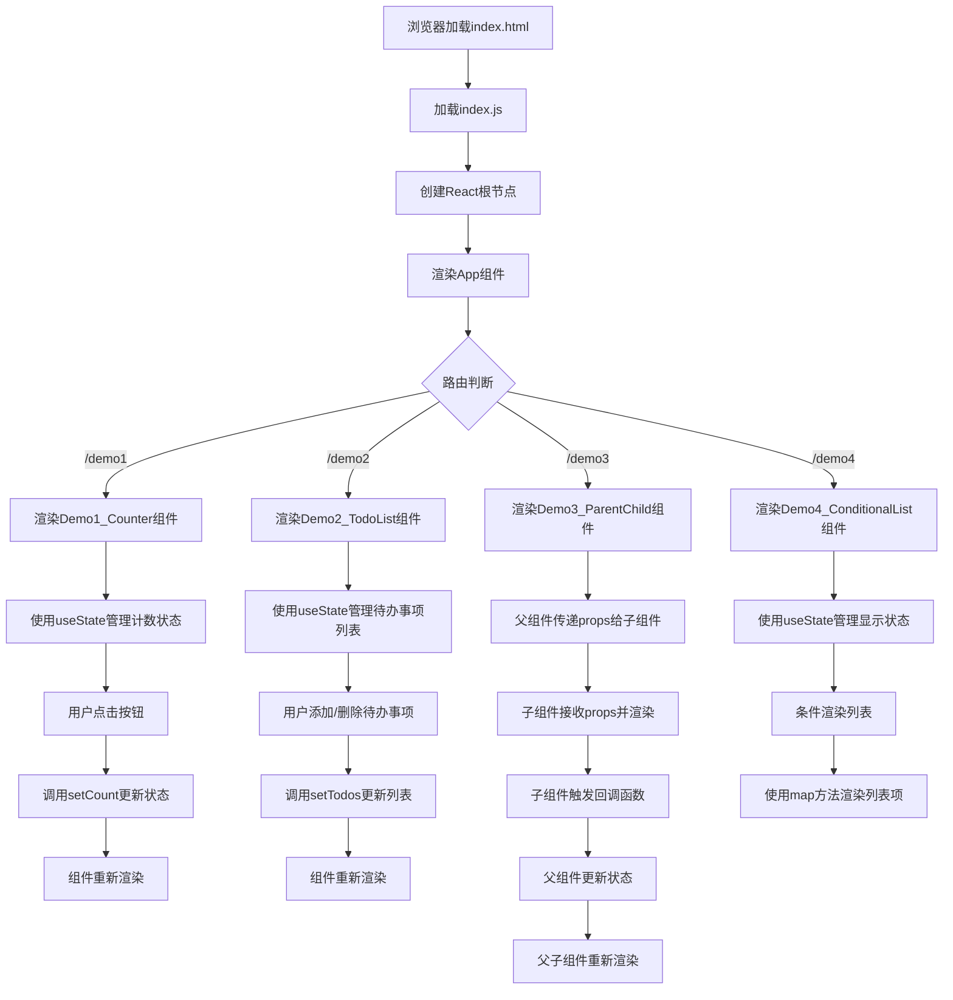

# React 学习项目分析

本项目是一个React学习示例，包含了多个基础Demo组件，用于展示React的核心概念和功能。

## 项目结构分析 
### 目录层级说明 
```
├── package-lock.json     # 依赖包版本锁定文件
├── package.json          # 项目配置和依赖管理文件
├── public\               # 静态资源目录
│   ├── favicon.ico       # 网站图标
│   ├── index.html        # HTML模板文件
│   ├── logo192.png       # React默认Logo
│   ├── logo512.png       # React默认Logo(大)
│   ├── manifest.json     # PWA应用配置文件
│   └── robots.txt        # 搜索引擎爬虫配置
└── src\                  # 源代码目录
    ├── App.css           # App组件样式
    ├── App.js            # 应用主组件，包含路由配置
    ├── App.test.js       # App组件测试文件
    ├── index.css         # 全局样式
    ├── index.js          # 应用入口文件
    ├── logo.svg          # React Logo SVG文件
    ├── reportWebVitals.js # 性能监测工具
    ├── routes\           # 路由组件目录
    │   ├── Demo1_Counter.jsx        # 计数器示例(useState)
    │   ├── Demo2_TodoList.jsx       # 待办事项列表示例
    │   ├── Demo3_ParentChild.jsx    # 父子组件通信示例
    │   └── Demo4_ConditionalList.jsx # 条件渲染和列表渲染示例
    └── setupTests.js     # 测试配置文件
```

### 主入口文件 
项目的主入口文件是 `src/index.js`，它的主要功能包括：

1. 导入React和ReactDOM核心库
2. 导入全局样式文件
3. 导入App主组件
4. 导入性能监测工具reportWebVitals
5. 创建React根节点，并将App组件渲染到DOM中
6. 启用React严格模式(StrictMode)进行开发时的额外检查
7. 初始化性能监测

App组件(`src/App.js`)是应用的主组件，负责：
1. 配置路由系统(使用react-router-dom)
2. 提供导航菜单
3. 根据URL路径渲染不同的Demo组件

### 依赖关系 
项目的核心依赖关系如下：

1. **核心库依赖**：
   - React: 前端UI库核心
   - ReactDOM: 将React组件渲染到DOM的库
   - React Router: 提供路由功能

2. **组件依赖关系**：
   - index.js → App.js: 主入口文件渲染App组件
   - App.js → Demo组件: App通过路由系统加载各个Demo组件
   - Demo组件之间相互独立，没有直接依赖关系

3. **状态管理**：
   - 所有Demo组件都使用React Hooks(useState)进行本地状态管理
   - 父子组件通信通过props和回调函数实现(Demo3_ParentChild.jsx)

4. **功能模块**：
   - Demo1_Counter: 展示useState基本用法
   - Demo2_TodoList: 展示列表操作和表单处理
   - Demo3_ParentChild: 展示组件通信
   - Demo4_ConditionalList: 展示条件渲染和列表渲染

## 运行流程图


### Analyzing the Bundle Size

This section has moved here: [https://facebook.github.io/create-react-app/docs/analyzing-the-bundle-size](https://facebook.github.io/create-react-app/docs/analyzing-the-bundle-size)

### Making a Progressive Web App

This section has moved here: [https://facebook.github.io/create-react-app/docs/making-a-progressive-web-app](https://facebook.github.io/create-react-app/docs/making-a-progressive-web-app)

### Advanced Configuration

This section has moved here: [https://facebook.github.io/create-react-app/docs/advanced-configuration](https://facebook.github.io/create-react-app/docs/advanced-configuration)

### Deployment

This section has moved here: [https://facebook.github.io/create-react-app/docs/deployment](https://facebook.github.io/create-react-app/docs/deployment)

### `npm run build` fails to minify

This section has moved here: [https://facebook.github.io/create-react-app/docs/troubleshooting#npm-run-build-fails-to-minify](https://facebook.github.io/create-react-app/docs/troubleshooting#npm-run-build-fails-to-minify)
